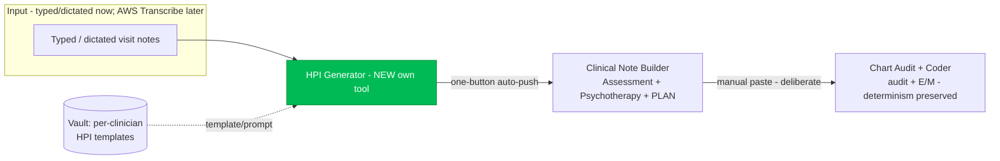

# Clinical Note Generator — Target Architecture (HPI + Plan)

**Status:** In active build. HPI Generator (Slices 1–3 + refinements) is live on `main`;
Plan section (Slice 4) and pre-visit prep are pending.
**Branch:** `claude/clinical-note-generator-audit-lzoeth`
**Last updated:** 2026-07-14

This document consolidates the audit of the current AI Scribe and proposes the
architecture for closing the **HPI + Plan gap** — the piece the Practice Manager
State File (v3) and Growth v6 both call the hero/upgrade lever. It reflects the
decisions made in the 2026-07-14 design discussion.

---

## 0. Product vision — the visit workspace

The tool is **THE place the clinician builds the note, during the visit — not a post-hoc
generator, and not a feature bolted onto the EHR.** The EHR becomes only the destination
for the finished note (and where the clinician prescribes). Intended loop for a
work-during-visit clinician:

1. **Set me up:** paste last visit's note → the tool produces the carry-forward starting
   point plus a short "to check / to ask" list for today (pre-visit prep).
2. **Work in the tool during the visit:** capture as-you-go; draft and refine live.
3. **Finish:** HPI → Note Builder (assessment + psychotherapy + Plan) → final note → paste
   into the EHR once. The clinician shouldn't touch the EHR except to prescribe.

This reframes the "buckets" as **stages of one visit lifecycle**, not separate tools:
pre-visit prep → live HPI → assessment / psychotherapy / plan → coder (optional) → EHR.
It also re-centers **pre-visit prep** as the *front door* that makes this a workspace
rather than a generator.

**After-visit / ambient path.** Working live in the tool is the optimized route — less
total work, and contemporaneous documentation is better clinically and medicolegally. A
clinician who charts *after* the visit inherently does more work; **ambient (AWS
Transcribe) is the equalizer** for those who can't type with a patient in the room —
capture during, draft after, feeding the *same* workspace. Both paths land in the same
place; live is simply leaner. Design for both; optimize for live.

---

## 0.1 Positioning & differentiation (vs other AI scribes)

**Category term vs. product.** Market it with the words clinicians already search for and
want — "AI Scribe" — because that is the door. But the product behind the door is a
different category: a **clinician-controlled psychiatric documentation workspace**, not an
ambient black box. The known term earns the click; the difference earns the subscription
(and justifies the recurring price the Growth v6 doc assigns the hero tool).

**What almost every AI scribe is** (Abridge, DAX, Suki, Nabla, Freed, Heidi, DeepScribe,
Ambience, …): an ambient listener that writes the whole note post-hoc, imposes its own
format, and leaves the clinician editing its guesses. The universal complaints:
hallucination, generic notes that are not the clinician's voice, cloned/boilerplate
content, loss of control, and mis-heard drug names. The clinician becomes a
charter-after-the-visit cleaning up the machine.

**How this is genuinely different:**
1. **Workspace, not scribe.** You build the note *during* the visit; the EHR is only the
   destination. No incumbent is positioned here (see §0).
2. **The clinician owns the output** — built from their template, structure, and voice via
   a wizard that *elicits* their way. Incumbents impose a format; this conforms to the user.
3. **It improves documentation instead of cloning it** — carry-forward hygiene,
   standing/dynamic/historical classes, Historical Notes, "continues to…" framing,
   "learn style not habits." The opposite of laundering a clinician's existing habits.
4. **Anti-fabrication as a first principle** — menus are checklists, quotes verbatim, meds
   untouched, implausible content *flagged, not "fixed."*
5. **Reasons into defensible psychiatric billing** — HPI → psychotherapy add-on
   defensibility → deterministic E&M coding. Generic scribes stop at "here's a note."
6. **Preps the clinician for the visit** ("Set me up") — no ambient scribe does this.

**Positioning trap to avoid:** do NOT lead with ambient or frame the product as "our
ambient scribe." Ambient is table stakes and not a race this wins by copying; it is **one
input to the workspace, not the product.**

**The one-liner (true of what is built):** *"It doesn't listen and guess. It's where you
build a defensible note, your way, and it stops you cloning your old notes forward."* Ties
directly to the *Education* in Think Beyond — it makes clinicians document **better**, not
just faster.

**Where to lean in (most defensible, hardest for incumbents to copy):** (a) the
carry-forward / "improve don't clone" story, and (b) the reasoning → defensible-coding
pipeline.

---

## 0.2 Hard constraint: it must FEEL like less work

All the personalization power in this tool is also its biggest adoption risk: it can curdle
into setup burden, choices, and step-count, so the tool feels like *more* work even though
it is more capable. That is how tools like this die. The power is only worth it if the
everyday experience is lighter than typing into the EHR. Non-negotiable rules:

1. **Zero-config first value.** First use with no template must still produce a good HPI
   from messy notes (it falls back to a conventional structure). Setup is optional and
   deferrable — never a gate before value.
2. **Setup is one-time and low-effort.** The wizard *learns from a pasted sample* and never
   makes a clinician write prompts from scratch; done once per template, then every visit is
   fast. It must feel like a payoff, not a chore.
3. **The everyday loop is minimal-tap.** Default hot path = paste → draft → (auto-review) →
   send/copy. No required choices beyond visit type; smart defaults everywhere.
4. **Optional means optional.** Prep, wizard, troubleshoot, capture-source, carry-forward
   config — all optional and progressively disclosed; none block the fast path.
5. **Speed is a feature.** Minimize latency on the hot path; anything that adds a model call
   must clearly earn its wait or run without the clinician staring at a spinner.
6. **Net-fewer-keystrokes test.** Every feature must remove more work than it adds versus
   typing into the EHR. If it doesn't, cut it.

Current state against this: zero-config default ✓, sample-driven one-time setup ✓, prep/
wizard/troubleshoot are optional buttons ✓. Watch items: main-screen control count, the
capture-source toggle as an extra choice, and auto-review latency on the hot path.

---

## 0.3 Governing check for EVERY prompt change: universal vs per-clinician

Before hardcoding ANY behavior into a prompt, ask: is this a **universal
integrity/safety rule** (true for every clinician) or a **preference** (format,
structure, verbosity, wording)? Only integrity/safety rules may be baked in globally.
Everything else must come from the clinician's template / Vault / elicitation — never
hardcoded — because a hardcoded preference silently breaks every clinician who wants it
differently. A format rule must be phrased **"follow the template,"** never "always do X."

- **Global (hardcoding OK):** anti-fabrication; quote-*meaning* fidelity; menus-as-
  checklists (endorsed-only); SI/HI never fabricated or carried forward; include
  documented content / no invented comparisons; plain text, no Markdown (for EHR paste).
- **Per-clinician (NEVER hardcode — template/Vault/elicitation drives it):** section
  labels vs. flowing narrative; label placement (inline vs. own line); which sections are
  dynamic/standing/historical; verbosity; verbatim vs. synthesized quotes; brand vs.
  generic med names; subheadings; section order.

Regression watched here: a "keep section labels" rule was first written as "always use
labels," which would have forced structure on a flowing-narrative clinician. Corrected to
"match the template's format faithfully, whatever it is."

---

## 1. Where it stands today (audit)

The "AI Scribe" is already **three separate tools joined by clinician copy-paste**,
not one monolith. There is no shared structured data object between them.

| Stage | Tool | Today | Model calls |
|---|---|---|---|
| **HPI** | *(none — gap)* | Clinician writes/dictates outside the app, pastes it in | — |
| **Assessment + psychotherapy** | `pm-clinical-note-builder.html` | Pasted HPI → diagnosis list + unified formulation + 5-part psychotherapy add-on blurb. **Refuses to write HPI or Plan.** | up to 4 (preflight cards → assess draft → QA review → therapy blurb) |
| **Audit + code** | `pm-chart-coder.html` | Completed note → documentation audit + E/M code. **LLM extracts facts; deterministic JS assigns MDM levels/code** (same note → same code every run). | 4 (Haiku preflight + Haiku audit ∥ Sonnet MDM → Sonnet verify) |

Load-bearing facts the redesign must respect:

- **Multi-call reasoning already works.** Both live tools are pipelines of focused
  calls on `clinical-proxy-stream` (`claude-sonnet-4-6` + `claude-haiku-4-5-20251001`).
  The reasoning win is banked; the open work is the **data handoff**, not call count.
- **The coder's determinism boundary is the crown jewel** (`pm-chart-coder.html`
  fact-extract → JS classifier → 2-of-3 E/M). Preserve it unchanged.
- **"Vault" today = the profile store** (`vault_profile`, 55+ fields via
  `user-tool-data.js`), **not** a note-template store. Per-clinician note templates
  are net-new.
- **No ambient/audio anywhere.** Typed/pasted text only. AWS Transcribe is the
  intended future route.
- **Dead code:** `chart-coder-trigger/background/poll.js` is a dormant, stale-prompt
  async trio the live frontend never calls. `MODEL-REGISTRY.md` coder/note-builder
  rows were stale (fixed in this branch).

---

## 2. Target architecture

Four tools, chained by a shared structured note object instead of copy-paste — while
each tool stays independently usable (a clinician can still paste straight into the
coder).



**The two handoffs are deliberately asymmetric:**

- **HPI → Note Builder = one-button auto-push.** Small feature, high value: the
  clinician clicks "Send to Note Builder" and the generated HPI (plus prior dx/plan
  context) lands pre-filled in the Note Builder. No re-paste.
- **Note Builder → Coder = stays manual.** *By design.* The goal is that clinicians
  lean on the Coder **less over time** as they learn to document correctly the first
  time — which also saves API cost. Auto-piping every note into the coder would work
  against both. The coder remains a deliberate, opt-in check.

---

## 3. The shared structured note object

A single client-side object that each tool reads/writes, replacing free-text
copy-paste. Kept in memory / `sessionStorage` (PHI — never persisted server-side
without the same BAA-covered treatment the tools already use).

```
ClinicalNote {
  visitType:        'new_eval' | 'follow_up'
  hpi:              string          // written by HPI Generator
  priorAssessment:  string          // carried context
  priorDiagnoses:   [{ code, label }]
  planInputs:       string          // "what you're doing this visit"
  assessment:       string          // written by Note Builder
  diagnoses:        [{ code, label, primary }]
  plan:             string          // written by Note Builder (NEW)
  psychotherapy:    { modality, intervention, focus, response, time, addOnCode }
  provenance:       { source: 'hpi_generator'|'manual'|'ambient', ... }
}
```

Rules:
- **No fabrication across the seam.** The Note Builder's existing source-fidelity
  guards ("every diagnosis/symptom must trace to source") apply to the object's
  `hpi`/`priorAssessment` fields exactly as they apply to pasted text today.
- **Independently usable.** If a field is empty (e.g. clinician skipped the HPI tool
  and pasted their own), tools fall back to their current paste-based behavior.
- **PHI stays transient.** Object lives for the session; matches today's "no PHI
  stored" posture. Not written to Supabase.

---

## 4. Vault additions (clinician-editable)

Everything here lives **in the Vault the clinician self-edits** — the `vault_profile`
record, surfaced as new editable fields in `vault.html` alongside the rest of their
profile. The whole point of the Vault is that the clinician goes in and edits their own
profile; none of this is a hidden, separate store. Two additions:

**A. HPI templates/prompts** — so the HPI Generator drafts in each clinician's own
structure/voice. Picked by `visitType`:
- **New Patient Eval HPI Template / Prompt**
- **Follow-up HPI Template / Prompt**

These are **style/structure/prompt guidance**, not clinical content — the HPI Generator
uses them to shape output, never to invent facts.

**B. Plan library** — the clinician's reusable Plan content the §6 Plan section pulls
from:
- **Area-specific numbers** (local crisis/ER lines, referral numbers).
- **Standard/reused wording** (their habitual PARQ line, monitoring/return-timing,
  refill/lab language, resource text).

Stored once, reused every note — so consent and resource text come from the clinician's
own stored wording, not from the model.

**C. How these get populated — the Setup wizard (do NOT rely on blank prompt boxes).**
Handing a clinician an empty "write your HPI template/prompt" field is intimidating,
produces bad prompts, and bad prompts produce bad output that kills trust. Instead, a
guided **Setup** flow populates the Vault for them:
- Asks a handful of questions (specialty, visit types, how they like the HPI structured,
  quote handling, etc.).
- **Accepts two inputs (added after testing):** their **blank scaffold** (section order +
  canned symptom menus — the primary template source, and PHI-free by nature) and/or a
  **completed example** (learns voice/detail). At least one is required.
- **Ingests them** and reverse-engineers a template + prompt that reproduces *their* style,
  keeping any generic symptom menus as checklists.
- **Adaptive elicitation before writing anything (upgraded after testing):** not a form —
  a skilled intake interviewer. It infers everything it can from the clinician's materials,
  then asks the smallest set of high-value questions to surface choices clinicians never
  think to specify, running up to two rounds (a second only if the first opens something
  important). It is **visit-aware**: for a follow-up it specifically elicits the
  **dynamic / standing / historical** classification of each section and whether they keep
  a persistent **"Historical Notes"** block — the exact personalization the carry-forward
  engine needs but that a scaffold never encodes. Answers are authoritative and are encoded
  into the generated template (including each section's carry-forward behavior).
  **Learn STYLE, not HABITS (critical correction):** a completed example note teaches only
  structure, order, and voice. The carry-forward classification is **elicited from the
  clinician's stated intent, never inferred from how their current note handles it** —
  their existing notes often contain the very habit the tool exists to fix (cloning
  content, not framing standing items as "continues to…"), so copying it would feed the
  problem back. The engine applies proper continued/stable framing regardless of the
  example's style; the wizard offers best-practice defaults to react to.
- **Writes the result into their Vault fields** for them to review/approve/tweak — they
  are never staring at a blank box.

**PHI never enters the Vault, and the clinician never has to de-identify.** The generated
template is structure/generic-phrasing only. A pasted completed example is processed
transiently through the BAA-covered proxy and **never stored**; only the PHI-free template
is saved, and the clinician reviews it before it writes. The blank scaffold path has no PHI
at all. So "de-identify if you prefer" was wrong and is removed — the burden is on the
system, not the clinician.

**D. Adjust / troubleshoot mode (added after testing).** The Setup is not one-shot. A
"Adjust / troubleshoot my current one" mode loads the clinician's existing template from the
Vault and works the problem *with* them conversationally: they describe what is going wrong
(optionally paste a bad HPI output), and the model diagnoses and revises the template in a
back-and-forth, preserving the universal integrity rules and changing only what the issue
calls for. Each turn returns the full updated template (editable inline); the clinician keeps
refining until they save it back to the Vault. Same PHI posture — bad-output examples are
transient, only the PHI-free template is stored.

The same wizard pattern populates the **Plan library** (§4B): question them → generate
their PARQ/standard wording + area numbers → write to Vault for approval. Learning from a
real example is also the best test of fidelity, so the wizard doubles as onboarding *and*
the fastest way to validate template-following. (Sequencing: the raw Vault fields + HPI
MVP ship first so it is testable with a hand-entered template; the wizard follows — see
§9.)

---

## 5. HPI Generator (new tool) — design

A new PHI tool, own page (`pm-hpi-generator.html`, clean path `/hpi`), gated exactly
like the other clinical tools (`auth-gate.js`, `requireFull:true`, PHI/BAA gate),
calling `clinical-proxy-stream`.

**Design principle — the input contract is the whole ballgame.** The tool must accept
the clinician's *raw, as-they-go capture* — running, chronological, question-order
fragments with verbatim patient quotes — NOT a pre-structured draft. If a clinician
feels they must tidy/structure the note before pasting it in, the tool has added a step
instead of removing one, and it will not be used. Its value is exactly the
reorganization the clinician currently does in their head: **take the messy running
stream → produce the clinician's structured HPI (per their Vault template), stitching in
connective clinical narrative, while preserving their verbatim quotes and inventing
nothing.** The input UI must say so explicitly ("paste your notes exactly as you took
them — fragments, shorthand, quotes; don't clean them up"). Corollary: typing-as-you-go
is *manual ambient* — same input shape as an AWS transcript — so building for this raw
input now is the on-ramp that makes ambient a drop-in later. Trust is earned by concrete
levers: the verify pass proves only-what-you-typed was used; output follows the
clinician's own template; verbatim quotes survive intact.

Pipeline of focused calls (the "reason better" pattern, kept):

1. **Structure/select** — load the clinician's `visitType` template from the Vault;
   assemble the typed input.
2. **Draft HPI** — `claude-sonnet-4-6`, drafts the HPI *strictly from the clinician's
   typed input*, shaped by their template. Anti-fabrication guard identical in spirit
   to the Note Builder's: no invented symptoms, dx, or timeline.
   - **Quote fidelity rule (verbatim, with a spelling guardrail):** patient quotes are
     preserved **verbatim in wording and meaning**, but with **orthographic
     normalization only** — fix spelling, obvious typos, and capitalization; **never**
     substitute words, paraphrase, or reinterpret. `"i feel anxous"` → `"I feel
     anxious"` ✓; `"I feel down"` → `"I feel depressed"` ✗ (that is interpretation, not
     spelling). Default to verbatim when the clinician's template is silent; the
     template/prompt may direct more synthesis if they want it.
   - **Template menus are checklists, not content (added after testing):** real templates
     carry maximal domain scaffolds and canned "associated symptoms include ..." menus.
     The prompt treats every menu as a checklist to filter against the visit, never as
     text to reproduce. A positive "associated symptoms include ..." list keeps **only
     endorsed** symptoms; denied / not-discussed / inferred-absent items are removed from
     it. Explicit clinician denials (SI/HI, "denies manic symptoms") stay as their own
     denial sentence, never folded back into the positive list. A domain or subtopic is
     included ONLY if the notes address it (untouched domains like ADHD/borderline are
     omitted, not printed as "denies").
   - **Placeholders and pronouns (added after testing):** templates carry bracketed
     placeholders (`[ ]`, `*[Narrative: ...]*`) and `Menu (...)` reference blocks — these
     are directions to the model and are NEVER emitted in the HPI (fill from notes or
     omit). Pronouns follow the *patient in the notes*, never the template's example
     gender; the wizard also now writes templates pronoun-neutral.
   - **Integrity rules global, format per-clinician (corrected after testing):** the
     global prompt owns only universal integrity rules (anti-fabrication, quote fidelity,
     menu-as-checklist). **All formatting — labels, order, subheadings, groupings —
     comes from the clinician's template, never hardcoded.** Anxiety subtypes get their
     own paragraphs/headers only if *that clinician's* template calls for it; nothing
     structural is imposed on everyone.
   - **Plain chart output, no Markdown (added after testing):** templates are often
     written in Markdown, and the draft was mirroring `## headings` and `---` dividers
     into the HPI. The draft now outputs plain EHR-ready text (labels on their own line,
     blank line between sections), and a `cleanMarkdown()` post-pass strips any residual
     `#`/`---`/`**`/`>` as a safety net.
   - **Risk, meds, length, editable output, implausibility flag (added after testing):**
     (a) **Risk/safety** is treated as highest-stakes — documented SI/HI/self-harm is
     never dropped, softened, or fabricated as a denial; ambiguity is preserved and
     flagged. (b) **Medications are kept exactly as written** — never normalized
     (no Zoloft→sertraline), never "corrected"; an implausible/unrecognized name or dose
     is preserved and flagged, not guessed. (c) **Verbosity is controlled by the
     clinician's Vault template**, not a separate control. (A brief/standard/thorough
     selector was built and then removed after testing: on an HPI it could only vary
     prose density, never clinical content, which the template already governs — so it
     was redundant.) (d) The **output is editable** in place; copy and the
     Note-Builder handoff use the edited text. (e) The auto-review **flags "sounds wrong"
     content** (misspelled drug names, implausible doses, contradictions, transcription
     artifacts) rather than silently fixing it — the right posture for ASR errors we
     cannot repair upstream (mitigated later by a medical-vocabulary ASR model, e.g. AWS
     Transcribe Medical).
   - **Follow-up carry-forward hygiene (added after testing).** For `visitType ===
     'follow_up'` with last visit's note in the continuity field, the draft merges the two
     the way a clinician cleans up a copied-forward note: **today's notes drive dynamic
     content** (mood, active symptoms, med response, side effects — never cloned from the
     prior note); **standing items** that don't change each visit (substance use,
     exercise, absence of hallucinations, history) **may carry forward but worded as
     continued/stable**, never as if freshly assessed today. A dynamic topic absent from
     today's notes is omitted/flagged, not fabricated. **Safety (SI/HI/self-harm) is
     never carried forward** — a prior denial must never read as performed today; the
     review flags it. **Nothing about which section is dynamic/standing/historical is
     hardcoded** — the clinician's template declares it (the engine's illustrative
     examples are just defaults); the engine only executes, with SI/HI-never-carried the
     single hardcoded rule. Four content classes: **dynamic** (today drives),
     **standing** (carry as continued/stable), **historical/chronic-known** — including a
     clinician's persistent **"Historical Notes:"** block — (carry as known background,
     never re-asked or re-asserted), and **safety** (never carried). This also gives the
     follow-up path real behavior (previously thin) and is the anti-clone-note /
     audit-integrity safeguard.
   - **Pre-visit prep (Bucket 1, BUILT):** the "Set me up for this visit" button — paste
     last visit's note and it returns (a) a **carry-forward starting note** (standing/
     historical items pre-filled as continued/stable, dynamic sections left as labeled
     prompts to fill during the visit, SI/HI left to assess today), (b) a **"to check / ask
     today"** list from last visit's threads, and (c) optional **psychotherapy focus**
     options (the Dev "For Next Time" idea moved to the front). "Work from this" loads the
     starting note into the working area, delivering steps 1–2 of the §0 workspace loop.
     Also absorbs the Copilot eval→follow-up "Carry Forward" button (same mechanism).
     Note-time reminder checklists (Bucket 3) are held — limited value since a missed
     in-visit question can't be recovered at charting time.
3. **QA/verify pass — now automatic (revised after testing).** Every draft is
   auto-reviewed by a second `claude-sonnet-4-6` call that silently corrects clear
   fabrications and surfaces only genuine flags — matching the Note Builder / v1 copilot
   "adversarial review" pattern. The earlier opt-in-button / cost-gating design is
   **superseded**: the clinician wanted it to "just fix it behind the scenes," so it runs
   on every draft (typed or transcript). The capture toggle remains but only informs the
   review (a transcript source also gets a mis-transcription check); it no longer gates
   whether the pass runs. Cost tradeoff (2 calls per draft) is accepted, consistent with
   the recurring-membership pricing model.
4. **Hand off** — populate `ClinicalNote.hpi` + context; enable the one-button push to
   the Note Builder.

Compliance notes:
- **PHI flow** — new clinical surface; per Growth v6, any new PHI flow is a
  "check with Joel first" item before it goes live to real members. Michael-only
  testing first (matches the State File's stated rollout for the HPI generator).
- **Models** — Sonnet for drafting/review; Haiku only for any cheap structural step.
  Use only proven strings: `claude-sonnet-4-6`, `claude-haiku-4-5-20251001`.

---

## 6. Plan section (in the Note Builder)

Per decision, **the Plan lives in the Note Builder**, not a separate tool. **Do NOT
port the Dev Note Builder wholesale** — that branch is older in places. The Plan is a
**new, distinct build** on the current (`main`) Note Builder.

The Plan section is **retrospective + administrative** — it is NOT the forward-looking
"For Next Time" guide (that is a separate, deferred item; see §7). It covers:

- **What was done this visit** — a factual account of the plan/actions from the visit,
  traceable to source (same no-fabrication guards as the assessment).
- **PARQ** — the informed-consent line (risks/benefits/alternatives/questions discussed)
  and comparable standard consent/attestation wording.
- **Standard administrative wording** the clinician reuses (return timing, monitoring,
  refill/lab language, crisis-line/resource text, etc.).

**Vault-backed Plan library.** Much of the above is boilerplate a clinician reuses
verbatim, and some of it is **area-specific numbers** (local crisis/ER lines, referral
numbers) and **habitual wording**. So the Vault gains a **Plan library**: the clinician
stores their standard numbers and reusable phrasings once, and the Plan section pulls
from it — generated visit-specific content + the clinician's own stored wording, rather
than the model inventing consent or resource text. (See §4 — the Vault now holds both
the HPI templates and this Plan library.)

---

## 7. Deferred enhancements

**A. "For Next Time" forward-looking guide** — a *separate* feature from the Plan
(§6). It generates 1-2 prospective therapeutic foci for the *next* visit, each with a
modality-framed intervention and a portable teachable skill, to help clinicians
actually do psychotherapy and know what to focus on. Its companion is the
**carry-forward check** (the `carryfwd` card): next visit, it checks whether the
planned focus was actually addressed before any of it is documented. A prototype
already exists on the `Dev` Note Builder (`FORNEXT_SYS` + `#fornext` + `carryfwd`).
**Plan:** bring this forward into the current Note Builder *eventually* — port the
mechanism, do not merge the older Dev file. Not in the first build.

**B. Ambient capture** — deferred, consistent with the State File's "ship the
defensible pieces first" decision. Intended route: **AWS Transcribe** as an **input
adapter** feeding transcribed text into the *same* HPI Generator — built **after** the
typed-input HPI tool is working and validated. AWS is transcription only; it does not
enter the model path (the model registry's "no AWS/Bedrock in the path" statement stays
true).

---

## 8. Open questions / dependencies

1. **Shared-object transport** — in-memory + `sessionStorage` hand-off vs. a query
   param payload for the one-button push. (Leaning: `sessionStorage`, PHI-safe,
   survives the page navigation.)
2. **Joel/PHI sign-off** — confirm the new HPI PHI flow before member rollout.
3. **Production branch confirmation** — proceeding on the assumption that **`main`** is
   the canonical/production line (it has the complete file set). Confirm.

*Resolved:*
- **Integration base:** build on **`main`** (this branch was cut from it). **Do not
  integrate the `Dev` Note Builder** — it is older in places. The "For Next Time"
  mechanism gets ported forward later (§7A), not merged from Dev.
- **Plan vs. For Next Time:** the Plan is retrospective/administrative (§6); "For Next
  Time" is a separate, deferred forward-looking guide (§7A).
- **Vault storage:** HPI templates *and* the Plan library are editable fields in
  `vault.html`, stored in the `vault_profile` record the clinician self-edits (§4).

---

## 9. Build sequence (proposed)

1. **Housekeeping** *(done in this branch)* — fix `MODEL-REGISTRY.md`; note the
   dormant chart-coder job trio.
2. **Slice 1 — testable HPI loop (Michael-only):**
   - Two HPI template fields (Eval + Follow-up) in `vault.html` → `vault_profile`.
   - **HPI Generator MVP** (`pm-hpi-generator.html`): raw as-you-go input → drafts to the
     clinician's Vault template, quote-verbatim with the spelling guardrail, "Used
     Ambient?" toggle + opt-in Verify button. Lets Michael hand-enter his real templates
     and test template-following now.
3. **Slice 2 — one-button HPI→Note Builder push** + the shared note object (scaffolding).
4. **Slice 3 — Setup wizard (§4C):** Q&A + sample-note ingest → generates the HPI
   template/prompt → writes to Vault for approval. The real onboarding for all providers.
5. **Slice 4 — Plan section in the Note Builder** (§6): retrospective/administrative,
   Vault-backed; plus the Plan-library Setup wizard. Built fresh on `main`, not Dev.
6. **Validate on Michael's own patients**, then member rollout (post Joel sign-off).
7. **Later:** "For Next Time" forward-looking guide (§7A), then AWS Transcribe ambient
   adapter into the HPI Generator (§7B).
