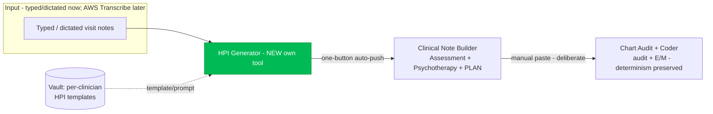

# Clinical Note Generator — Target Architecture (HPI + Plan)

**Status:** Proposal for review. No implementation yet.
**Branch:** `claude/clinical-note-generator-audit-lzoeth`
**Last updated:** 2026-07-14

This document consolidates the audit of the current AI Scribe and proposes the
architecture for closing the **HPI + Plan gap** — the piece the Practice Manager
State File (v3) and Growth v6 both call the hero/upgrade lever. It reflects the
decisions made in the 2026-07-14 design discussion.

---

## 1. Where it stands today (audit)

The "AI Scribe" is already **three separate tools joined by clinician copy-paste**,
not one monolith. There is no shared structured data object between them.

| Stage | Tool | Today | Model calls |
|---|---|---|---|
| **HPI** | *(none — gap)* | Clinician writes/dictates outside the app, pastes it in | — |
| **Assessment + psychotherapy** | `pm-clinical-note-builder.html` | Pasted HPI → diagnosis list + unified formulation + 5-part psychotherapy add-on blurb. **Refuses to write HPI or Plan.** | up to 4 (preflight cards → assess draft → QA review → therapy blurb) |
| **Audit + code** | `pm-chart-coder.html` | Completed note → documentation audit + E/M code. **LLM extracts facts; deterministic JS assigns MDM levels/code** (same note → same code every run). | 4 (Haiku preflight + Haiku audit ∥ Sonnet MDM → Sonnet verify) |

Load-bearing facts the redesign must respect:

- **Multi-call reasoning already works.** Both live tools are pipelines of focused
  calls on `clinical-proxy-stream` (`claude-sonnet-4-6` + `claude-haiku-4-5-20251001`).
  The reasoning win is banked; the open work is the **data handoff**, not call count.
- **The coder's determinism boundary is the crown jewel** (`pm-chart-coder.html`
  fact-extract → JS classifier → 2-of-3 E/M). Preserve it unchanged.
- **"Vault" today = the profile store** (`vault_profile`, 55+ fields via
  `user-tool-data.js`), **not** a note-template store. Per-clinician note templates
  are net-new.
- **No ambient/audio anywhere.** Typed/pasted text only. AWS Transcribe is the
  intended future route.
- **Dead code:** `chart-coder-trigger/background/poll.js` is a dormant, stale-prompt
  async trio the live frontend never calls. `MODEL-REGISTRY.md` coder/note-builder
  rows were stale (fixed in this branch).

---

## 2. Target architecture

Four tools, chained by a shared structured note object instead of copy-paste — while
each tool stays independently usable (a clinician can still paste straight into the
coder).



**The two handoffs are deliberately asymmetric:**

- **HPI → Note Builder = one-button auto-push.** Small feature, high value: the
  clinician clicks "Send to Note Builder" and the generated HPI (plus prior dx/plan
  context) lands pre-filled in the Note Builder. No re-paste.
- **Note Builder → Coder = stays manual.** *By design.* The goal is that clinicians
  lean on the Coder **less over time** as they learn to document correctly the first
  time — which also saves API cost. Auto-piping every note into the coder would work
  against both. The coder remains a deliberate, opt-in check.

---

## 3. The shared structured note object

A single client-side object that each tool reads/writes, replacing free-text
copy-paste. Kept in memory / `sessionStorage` (PHI — never persisted server-side
without the same BAA-covered treatment the tools already use).

```
ClinicalNote {
  visitType:        'new_eval' | 'follow_up'
  hpi:              string          // written by HPI Generator
  priorAssessment:  string          // carried context
  priorDiagnoses:   [{ code, label }]
  planInputs:       string          // "what you're doing this visit"
  assessment:       string          // written by Note Builder
  diagnoses:        [{ code, label, primary }]
  plan:             string          // written by Note Builder (NEW)
  psychotherapy:    { modality, intervention, focus, response, time, addOnCode }
  provenance:       { source: 'hpi_generator'|'manual'|'ambient', ... }
}
```

Rules:
- **No fabrication across the seam.** The Note Builder's existing source-fidelity
  guards ("every diagnosis/symptom must trace to source") apply to the object's
  `hpi`/`priorAssessment` fields exactly as they apply to pasted text today.
- **Independently usable.** If a field is empty (e.g. clinician skipped the HPI tool
  and pasted their own), tools fall back to their current paste-based behavior.
- **PHI stays transient.** Object lives for the session; matches today's "no PHI
  stored" posture. Not written to Supabase.

---

## 4. Vault: per-clinician HPI templates

Add **two** template slots to the Vault so the HPI Generator can draft in each
clinician's own structure/voice:

- **New Patient Eval HPI Template / Prompt**
- **Follow-up HPI Template / Prompt**

Storage: extend the existing `vault_profile` schema (or a dedicated
`note_templates` toolId under `user-tool-data.js` — decision in §8). These are
**style/structure templates and prompt guidance**, not clinical content — the HPI
Generator uses them to shape output, never to invent facts. The HPI Generator picks
the template by `visitType`.

---

## 5. HPI Generator (new tool) — design

A new PHI tool, own page (`pm-hpi-generator.html`, clean path `/hpi`), gated exactly
like the other clinical tools (`auth-gate.js`, `requireFull:true`, PHI/BAA gate),
calling `clinical-proxy-stream`.

Pipeline of focused calls (the "reason better" pattern, kept):

1. **Structure/select** — load the clinician's `visitType` template from the Vault;
   assemble the typed input.
2. **Draft HPI** — `claude-sonnet-4-6`, drafts the HPI *strictly from the clinician's
   typed input*, shaped by their template. Anti-fabrication guard identical in spirit
   to the Note Builder's: no invented symptoms, dx, or timeline.
3. **QA/review pass** — a second focused call that flags anything not traceable to the
   input (mirrors the Note Builder's existing review pass), surfacing flags rather than
   silently editing where clinically material.
4. **Hand off** — populate `ClinicalNote.hpi` + context; enable the one-button push to
   the Note Builder.

Compliance notes:
- **PHI flow** — new clinical surface; per Growth v6, any new PHI flow is a
  "check with Joel first" item before it goes live to real members. Michael-only
  testing first (matches the State File's stated rollout for the HPI generator).
- **Models** — Sonnet for drafting/review; Haiku only for any cheap structural step.
  Use only proven strings: `claude-sonnet-4-6`, `claude-haiku-4-5-20251001`.

---

## 6. Plan generation (in the Note Builder)

Per decision, **the Plan lives in the Note Builder**, not a separate tool. This
removes the Note Builder's current hard prohibition on generating a Plan and adds a
Plan section alongside the assessment + psychotherapy outputs, calibrated to visit
type and the `planInputs` field. Same source-fidelity + no-fabrication guards.

> **Open dependency:** review the "slightly newer feature" in Michael's **Dev** copy
> of the Note Builder before finalizing this section — it may inform how the Plan
> section is structured or handed off. Location TBD (see §8).

---

## 7. Ambient (deferred)

Ambient/audio capture is **deferred**, consistent with the State File's
"ship the defensible pieces first" decision. Intended route: **AWS Transcribe** as an
**input adapter** that feeds transcribed text into the *same* HPI Generator — built
**after** the typed-input HPI tool is working and validated. AWS is transcription only;
it does not enter the model path (the model registry's "no AWS/Bedrock in the path"
statement stays true).

---

## 8. Open questions / dependencies

1. **Dev Note Builder feature** — where does Michael's Dev copy live (URL / Drive /
   local)? Needed before finalizing §6 (Plan).
2. **Vault storage shape** — extend `vault_profile` vs. new `note_templates` toolId.
   (Leaning: new toolId keeps the profile schema clean and scopes template access.)
3. **Shared-object transport** — in-memory + `sessionStorage` hand-off vs. a query
   param payload for the one-button push. (Leaning: `sessionStorage`, PHI-safe,
   survives the page navigation.)
4. **Joel/PHI sign-off** — confirm the new HPI PHI flow before member rollout.

---

## 9. Build sequence (proposed)

1. **Housekeeping** *(done in this branch)* — fix `MODEL-REGISTRY.md`; note the
   dormant chart-coder job trio.
2. **Shared note object + one-button HPI→Note Builder push** (scaffolding).
3. **HPI Generator tool** (typed input + Vault templates), Michael-only.
4. **Vault: two HPI template slots.**
5. **Plan section in the Note Builder** (after reviewing the Dev feature).
6. **Validate on Michael's own patients**, then member rollout (post Joel sign-off).
7. **Later:** AWS Transcribe ambient adapter into the HPI Generator.
