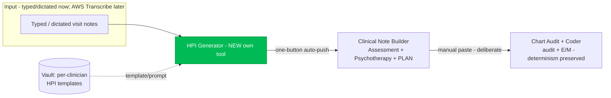

# Clinical Note Generator — Target Architecture (HPI + Plan)

**Status:** Proposal for review. No implementation yet.
**Branch:** `claude/clinical-note-generator-audit-lzoeth`
**Last updated:** 2026-07-14

This document consolidates the audit of the current AI Scribe and proposes the
architecture for closing the **HPI + Plan gap** — the piece the Practice Manager
State File (v3) and Growth v6 both call the hero/upgrade lever. It reflects the
decisions made in the 2026-07-14 design discussion.

---

## 1. Where it stands today (audit)

The "AI Scribe" is already **three separate tools joined by clinician copy-paste**,
not one monolith. There is no shared structured data object between them.

| Stage | Tool | Today | Model calls |
|---|---|---|---|
| **HPI** | *(none — gap)* | Clinician writes/dictates outside the app, pastes it in | — |
| **Assessment + psychotherapy** | `pm-clinical-note-builder.html` | Pasted HPI → diagnosis list + unified formulation + 5-part psychotherapy add-on blurb. **Refuses to write HPI or Plan.** | up to 4 (preflight cards → assess draft → QA review → therapy blurb) |
| **Audit + code** | `pm-chart-coder.html` | Completed note → documentation audit + E/M code. **LLM extracts facts; deterministic JS assigns MDM levels/code** (same note → same code every run). | 4 (Haiku preflight + Haiku audit ∥ Sonnet MDM → Sonnet verify) |

Load-bearing facts the redesign must respect:

- **Multi-call reasoning already works.** Both live tools are pipelines of focused
  calls on `clinical-proxy-stream` (`claude-sonnet-4-6` + `claude-haiku-4-5-20251001`).
  The reasoning win is banked; the open work is the **data handoff**, not call count.
- **The coder's determinism boundary is the crown jewel** (`pm-chart-coder.html`
  fact-extract → JS classifier → 2-of-3 E/M). Preserve it unchanged.
- **"Vault" today = the profile store** (`vault_profile`, 55+ fields via
  `user-tool-data.js`), **not** a note-template store. Per-clinician note templates
  are net-new.
- **No ambient/audio anywhere.** Typed/pasted text only. AWS Transcribe is the
  intended future route.
- **Dead code:** `chart-coder-trigger/background/poll.js` is a dormant, stale-prompt
  async trio the live frontend never calls. `MODEL-REGISTRY.md` coder/note-builder
  rows were stale (fixed in this branch).

---

## 2. Target architecture

Four tools, chained by a shared structured note object instead of copy-paste — while
each tool stays independently usable (a clinician can still paste straight into the
coder).



**The two handoffs are deliberately asymmetric:**

- **HPI → Note Builder = one-button auto-push.** Small feature, high value: the
  clinician clicks "Send to Note Builder" and the generated HPI (plus prior dx/plan
  context) lands pre-filled in the Note Builder. No re-paste.
- **Note Builder → Coder = stays manual.** *By design.* The goal is that clinicians
  lean on the Coder **less over time** as they learn to document correctly the first
  time — which also saves API cost. Auto-piping every note into the coder would work
  against both. The coder remains a deliberate, opt-in check.

---

## 3. The shared structured note object

A single client-side object that each tool reads/writes, replacing free-text
copy-paste. Kept in memory / `sessionStorage` (PHI — never persisted server-side
without the same BAA-covered treatment the tools already use).

```
ClinicalNote {
  visitType:        'new_eval' | 'follow_up'
  hpi:              string          // written by HPI Generator
  priorAssessment:  string          // carried context
  priorDiagnoses:   [{ code, label }]
  planInputs:       string          // "what you're doing this visit"
  assessment:       string          // written by Note Builder
  diagnoses:        [{ code, label, primary }]
  plan:             string          // written by Note Builder (NEW)
  psychotherapy:    { modality, intervention, focus, response, time, addOnCode }
  provenance:       { source: 'hpi_generator'|'manual'|'ambient', ... }
}
```

Rules:
- **No fabrication across the seam.** The Note Builder's existing source-fidelity
  guards ("every diagnosis/symptom must trace to source") apply to the object's
  `hpi`/`priorAssessment` fields exactly as they apply to pasted text today.
- **Independently usable.** If a field is empty (e.g. clinician skipped the HPI tool
  and pasted their own), tools fall back to their current paste-based behavior.
- **PHI stays transient.** Object lives for the session; matches today's "no PHI
  stored" posture. Not written to Supabase.

---

## 4. Vault additions (clinician-editable)

Everything here lives **in the Vault the clinician self-edits** — the `vault_profile`
record, surfaced as new editable fields in `vault.html` alongside the rest of their
profile. The whole point of the Vault is that the clinician goes in and edits their own
profile; none of this is a hidden, separate store. Two additions:

**A. HPI templates/prompts** — so the HPI Generator drafts in each clinician's own
structure/voice. Picked by `visitType`:
- **New Patient Eval HPI Template / Prompt**
- **Follow-up HPI Template / Prompt**

These are **style/structure/prompt guidance**, not clinical content — the HPI Generator
uses them to shape output, never to invent facts.

**B. Plan library** — the clinician's reusable Plan content the §6 Plan section pulls
from:
- **Area-specific numbers** (local crisis/ER lines, referral numbers).
- **Standard/reused wording** (their habitual PARQ line, monitoring/return-timing,
  refill/lab language, resource text).

Stored once, reused every note — so consent and resource text come from the clinician's
own stored wording, not from the model.

**C. How these get populated — the Setup wizard (do NOT rely on blank prompt boxes).**
Handing a clinician an empty "write your HPI template/prompt" field is intimidating,
produces bad prompts, and bad prompts produce bad output that kills trust. Instead, a
guided **Setup** flow populates the Vault for them:
- Asks a handful of questions (specialty, visit types, how they like the HPI structured,
  quote handling, etc.).
- **Accepts two inputs (added after testing):** their **blank scaffold** (section order +
  canned symptom menus — the primary template source, and PHI-free by nature) and/or a
  **completed example** (learns voice/detail). At least one is required.
- **Ingests them** and reverse-engineers a template + prompt that reproduces *their* style,
  keeping any generic symptom menus as checklists.
- **Clarify step before writing anything (added after testing):** a first pass reviews the
  inputs and asks a few follow-up questions **only if something is genuinely ambiguous**
  (unclear order, positive-vs-denial menu handling, sample/preference conflict, quote
  style). If all is clear it asks nothing. The clinician's answers become authoritative
  preferences fed into the build. Mirrors the Note Builder / Chart Coder preflight pattern.
- **Writes the result into their Vault fields** for them to review/approve/tweak — they
  are never staring at a blank box.

**PHI never enters the Vault, and the clinician never has to de-identify.** The generated
template is structure/generic-phrasing only. A pasted completed example is processed
transiently through the BAA-covered proxy and **never stored**; only the PHI-free template
is saved, and the clinician reviews it before it writes. The blank scaffold path has no PHI
at all. So "de-identify if you prefer" was wrong and is removed — the burden is on the
system, not the clinician.

**D. Adjust / troubleshoot mode (added after testing).** The Setup is not one-shot. A
"Adjust / troubleshoot my current one" mode loads the clinician's existing template from the
Vault and works the problem *with* them conversationally: they describe what is going wrong
(optionally paste a bad HPI output), and the model diagnoses and revises the template in a
back-and-forth, preserving the universal integrity rules and changing only what the issue
calls for. Each turn returns the full updated template (editable inline); the clinician keeps
refining until they save it back to the Vault. Same PHI posture — bad-output examples are
transient, only the PHI-free template is stored.

The same wizard pattern populates the **Plan library** (§4B): question them → generate
their PARQ/standard wording + area numbers → write to Vault for approval. Learning from a
real example is also the best test of fidelity, so the wizard doubles as onboarding *and*
the fastest way to validate template-following. (Sequencing: the raw Vault fields + HPI
MVP ship first so it is testable with a hand-entered template; the wizard follows — see
§9.)

---

## 5. HPI Generator (new tool) — design

A new PHI tool, own page (`pm-hpi-generator.html`, clean path `/hpi`), gated exactly
like the other clinical tools (`auth-gate.js`, `requireFull:true`, PHI/BAA gate),
calling `clinical-proxy-stream`.

**Design principle — the input contract is the whole ballgame.** The tool must accept
the clinician's *raw, as-they-go capture* — running, chronological, question-order
fragments with verbatim patient quotes — NOT a pre-structured draft. If a clinician
feels they must tidy/structure the note before pasting it in, the tool has added a step
instead of removing one, and it will not be used. Its value is exactly the
reorganization the clinician currently does in their head: **take the messy running
stream → produce the clinician's structured HPI (per their Vault template), stitching in
connective clinical narrative, while preserving their verbatim quotes and inventing
nothing.** The input UI must say so explicitly ("paste your notes exactly as you took
them — fragments, shorthand, quotes; don't clean them up"). Corollary: typing-as-you-go
is *manual ambient* — same input shape as an AWS transcript — so building for this raw
input now is the on-ramp that makes ambient a drop-in later. Trust is earned by concrete
levers: the verify pass proves only-what-you-typed was used; output follows the
clinician's own template; verbatim quotes survive intact.

Pipeline of focused calls (the "reason better" pattern, kept):

1. **Structure/select** — load the clinician's `visitType` template from the Vault;
   assemble the typed input.
2. **Draft HPI** — `claude-sonnet-4-6`, drafts the HPI *strictly from the clinician's
   typed input*, shaped by their template. Anti-fabrication guard identical in spirit
   to the Note Builder's: no invented symptoms, dx, or timeline.
   - **Quote fidelity rule (verbatim, with a spelling guardrail):** patient quotes are
     preserved **verbatim in wording and meaning**, but with **orthographic
     normalization only** — fix spelling, obvious typos, and capitalization; **never**
     substitute words, paraphrase, or reinterpret. `"i feel anxous"` → `"I feel
     anxious"` ✓; `"I feel down"` → `"I feel depressed"` ✗ (that is interpretation, not
     spelling). Default to verbatim when the clinician's template is silent; the
     template/prompt may direct more synthesis if they want it.
   - **Template menus are checklists, not content (added after testing):** real templates
     carry maximal domain scaffolds and canned "associated symptoms include ..." menus.
     The prompt treats every menu as a checklist to filter against the visit, never as
     text to reproduce. A positive "associated symptoms include ..." list keeps **only
     endorsed** symptoms; denied / not-discussed / inferred-absent items are removed from
     it. Explicit clinician denials (SI/HI, "denies manic symptoms") stay as their own
     denial sentence, never folded back into the positive list. A domain or subtopic is
     included ONLY if the notes address it (untouched domains like ADHD/borderline are
     omitted, not printed as "denies").
   - **Placeholders and pronouns (added after testing):** templates carry bracketed
     placeholders (`[ ]`, `*[Narrative: ...]*`) and `Menu (...)` reference blocks — these
     are directions to the model and are NEVER emitted in the HPI (fill from notes or
     omit). Pronouns follow the *patient in the notes*, never the template's example
     gender; the wizard also now writes templates pronoun-neutral.
   - **Integrity rules global, format per-clinician (corrected after testing):** the
     global prompt owns only universal integrity rules (anti-fabrication, quote fidelity,
     menu-as-checklist). **All formatting — labels, order, subheadings, groupings —
     comes from the clinician's template, never hardcoded.** Anxiety subtypes get their
     own paragraphs/headers only if *that clinician's* template calls for it; nothing
     structural is imposed on everyone.
   - **Plain chart output, no Markdown (added after testing):** templates are often
     written in Markdown, and the draft was mirroring `## headings` and `---` dividers
     into the HPI. The draft now outputs plain EHR-ready text (labels on their own line,
     blank line between sections), and a `cleanMarkdown()` post-pass strips any residual
     `#`/`---`/`**`/`>` as a safety net.
3. **QA/verify pass — now automatic (revised after testing).** Every draft is
   auto-reviewed by a second `claude-sonnet-4-6` call that silently corrects clear
   fabrications and surfaces only genuine flags — matching the Note Builder / v1 copilot
   "adversarial review" pattern. The earlier opt-in-button / cost-gating design is
   **superseded**: the clinician wanted it to "just fix it behind the scenes," so it runs
   on every draft (typed or transcript). The capture toggle remains but only informs the
   review (a transcript source also gets a mis-transcription check); it no longer gates
   whether the pass runs. Cost tradeoff (2 calls per draft) is accepted, consistent with
   the recurring-membership pricing model.
4. **Hand off** — populate `ClinicalNote.hpi` + context; enable the one-button push to
   the Note Builder.

Compliance notes:
- **PHI flow** — new clinical surface; per Growth v6, any new PHI flow is a
  "check with Joel first" item before it goes live to real members. Michael-only
  testing first (matches the State File's stated rollout for the HPI generator).
- **Models** — Sonnet for drafting/review; Haiku only for any cheap structural step.
  Use only proven strings: `claude-sonnet-4-6`, `claude-haiku-4-5-20251001`.

---

## 6. Plan section (in the Note Builder)

Per decision, **the Plan lives in the Note Builder**, not a separate tool. **Do NOT
port the Dev Note Builder wholesale** — that branch is older in places. The Plan is a
**new, distinct build** on the current (`main`) Note Builder.

The Plan section is **retrospective + administrative** — it is NOT the forward-looking
"For Next Time" guide (that is a separate, deferred item; see §7). It covers:

- **What was done this visit** — a factual account of the plan/actions from the visit,
  traceable to source (same no-fabrication guards as the assessment).
- **PARQ** — the informed-consent line (risks/benefits/alternatives/questions discussed)
  and comparable standard consent/attestation wording.
- **Standard administrative wording** the clinician reuses (return timing, monitoring,
  refill/lab language, crisis-line/resource text, etc.).

**Vault-backed Plan library.** Much of the above is boilerplate a clinician reuses
verbatim, and some of it is **area-specific numbers** (local crisis/ER lines, referral
numbers) and **habitual wording**. So the Vault gains a **Plan library**: the clinician
stores their standard numbers and reusable phrasings once, and the Plan section pulls
from it — generated visit-specific content + the clinician's own stored wording, rather
than the model inventing consent or resource text. (See §4 — the Vault now holds both
the HPI templates and this Plan library.)

---

## 7. Deferred enhancements

**A. "For Next Time" forward-looking guide** — a *separate* feature from the Plan
(§6). It generates 1-2 prospective therapeutic foci for the *next* visit, each with a
modality-framed intervention and a portable teachable skill, to help clinicians
actually do psychotherapy and know what to focus on. Its companion is the
**carry-forward check** (the `carryfwd` card): next visit, it checks whether the
planned focus was actually addressed before any of it is documented. A prototype
already exists on the `Dev` Note Builder (`FORNEXT_SYS` + `#fornext` + `carryfwd`).
**Plan:** bring this forward into the current Note Builder *eventually* — port the
mechanism, do not merge the older Dev file. Not in the first build.

**B. Ambient capture** — deferred, consistent with the State File's "ship the
defensible pieces first" decision. Intended route: **AWS Transcribe** as an **input
adapter** feeding transcribed text into the *same* HPI Generator — built **after** the
typed-input HPI tool is working and validated. AWS is transcription only; it does not
enter the model path (the model registry's "no AWS/Bedrock in the path" statement stays
true).

---

## 8. Open questions / dependencies

1. **Shared-object transport** — in-memory + `sessionStorage` hand-off vs. a query
   param payload for the one-button push. (Leaning: `sessionStorage`, PHI-safe,
   survives the page navigation.)
2. **Joel/PHI sign-off** — confirm the new HPI PHI flow before member rollout.
3. **Production branch confirmation** — proceeding on the assumption that **`main`** is
   the canonical/production line (it has the complete file set). Confirm.

*Resolved:*
- **Integration base:** build on **`main`** (this branch was cut from it). **Do not
  integrate the `Dev` Note Builder** — it is older in places. The "For Next Time"
  mechanism gets ported forward later (§7A), not merged from Dev.
- **Plan vs. For Next Time:** the Plan is retrospective/administrative (§6); "For Next
  Time" is a separate, deferred forward-looking guide (§7A).
- **Vault storage:** HPI templates *and* the Plan library are editable fields in
  `vault.html`, stored in the `vault_profile` record the clinician self-edits (§4).

---

## 9. Build sequence (proposed)

1. **Housekeeping** *(done in this branch)* — fix `MODEL-REGISTRY.md`; note the
   dormant chart-coder job trio.
2. **Slice 1 — testable HPI loop (Michael-only):**
   - Two HPI template fields (Eval + Follow-up) in `vault.html` → `vault_profile`.
   - **HPI Generator MVP** (`pm-hpi-generator.html`): raw as-you-go input → drafts to the
     clinician's Vault template, quote-verbatim with the spelling guardrail, "Used
     Ambient?" toggle + opt-in Verify button. Lets Michael hand-enter his real templates
     and test template-following now.
3. **Slice 2 — one-button HPI→Note Builder push** + the shared note object (scaffolding).
4. **Slice 3 — Setup wizard (§4C):** Q&A + sample-note ingest → generates the HPI
   template/prompt → writes to Vault for approval. The real onboarding for all providers.
5. **Slice 4 — Plan section in the Note Builder** (§6): retrospective/administrative,
   Vault-backed; plus the Plan-library Setup wizard. Built fresh on `main`, not Dev.
6. **Validate on Michael's own patients**, then member rollout (post Joel sign-off).
7. **Later:** "For Next Time" forward-looking guide (§7A), then AWS Transcribe ambient
   adapter into the HPI Generator (§7B).
